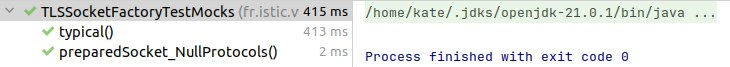

# Mocks to the rescue

The classes `SSLSocket`, `TLSProtocol` and `TLSSocketFactory` are included in the `sockets` package of the [`tp3-ssl`](../code/tp3-ssl) project.

The test class `TLSSocketFactoryTest` tests `TLSSocketFactory` and manually builds stubs and mocks for SSLSocket objects.

Rewrite these tests with the help of Mockito.

The initial tests fail to completely test the `TLSSockeetFactory`. In fact, if we *entirely* remove the code inside the body of `prepareSocket` no test case fails.

Propose a solution to this problem in your new Mockito-based test cases.

## Answer

### 1. Mockito

To rewrite the tests using `Mockito`, it's necessary to create mock objects for the `SSLSocket` and then use `Mockito` to verify interactions and set expectations. This was done in the `TLSSocketFactoryTestMocks` file. Result:

### 2. Issue where removing the entire body of `prepareSocket` doesn't cause any test case to fail

To solve the problem where removing the entire body of `prepareSocket` does not cause any test cases to fail, I use the `verify` method from `Mockito` to ensure that certain methods are called on the mock object.

In the tests, `verify(mockSocket).getSupportedProtocols()` and `verify(mockSocket).getEnabledProtocols()` ensure that these methods are indeed called during the execution of `prepareSocket`. If the entire body is removed from `prepareSocket`, these checks will fail, indicating that there are no significant interactions with `SSLSocket`.