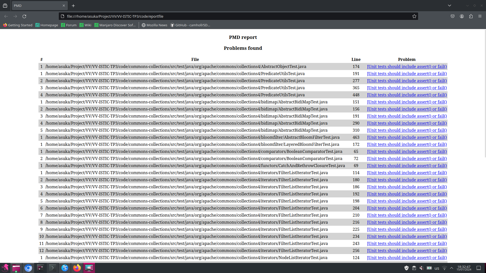
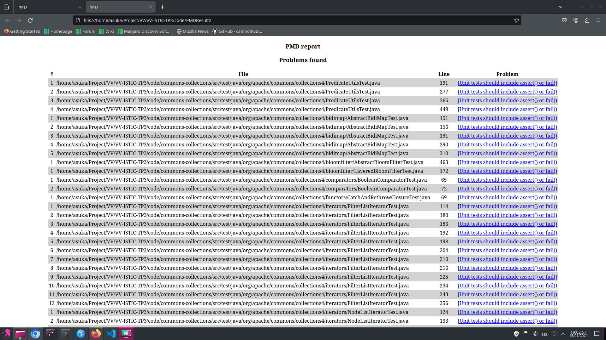

# Detecting test smells with PMD

In folder [`pmd-documentation`](../pmd-documentation) you will find the documentation of a selection of PMD rules designed to catch test smells.
Identify which of the test smells discussed in classes are implemented by these rules.

Use one of the rules to detect a test smell in one of the following projects:

- [Apache Commons Collections](https://github.com/apache/commons-collections)
- [Apache Commons CLI](https://github.com/apache/commons-cli)
- [Apache Commons Math](https://github.com/apache/commons-math)
- [Apache Commons Lang](https://github.com/apache/commons-lang)

Discuss the test smell you found with the help of PMD and propose here an improvement.
Include the improved test code in this file.

## Answer

# After reading the assignment, we decided to break it down into 3 sub-assignments :

## Assignment 1:
Identify which of the test smells discussed in classes are implemented by these rules(rules in folder pmd-documentation).

## Assignment 2:
Utilize one of the rules to detect a test smell in one of the following projects: Apache Commons Collections? Apache Commons CLI Apache Commons Math Apache Commons Lang

## Assignment 3:
Discuss the test smell you found using PMD and propose an improvement here. Include the improved test code in this file.


## Answer 1:
JUnit4TestShouldUseTestAnnotation.md: This rule matches "smell" when test methods are not marked with the @Test annotation.

JUnit4TestShouldUseBeforeAnnotation.md: This rule matches the "smell" when there is no method executed before each test method marked with the @Before annotation.

JUnit4TestShouldUseAfterAnnotation.md: This rule matches the "smell" when there is no method executed after each test method marked with the @After annotation.

JUnit4SuitesShouldUseSuiteAnnotation.md: This rule matches "smell" when a test class intended to be used in Suite is not marked with the @Suite annotation.

JUnitStaticSuite.md: This rule is possibly related to the use of static methods in test classes, which may be inefficient.

JUnitAssertionsShouldIncludeMessage.md: This rule matches the "smell" when assertions (assertions) in tests do not contain messages.

JUnitTestContainsTooManyAsserts.md: This rule matches the "smell" when a test contains too many assertions, which can make it difficult to maintain.

JUnitTestsShouldIncludeAssert.md: This rule matches the "smell" when the test does not contain assertions.

## Answer 2:
For our example, we took the JUnitTestsShouldIncludeAssert rule, which checks if assertions are included in JUnit tests.

We took the test code from the Apache Commons Collections project, specifically from the test folder.

To run the test, we used the command:
```
pmd check -d /home/asuka/Project/VV/VV-ISTIC-TP3/code/commons-collections/src/test/java/org/apache/commons/collections4/ -R category/java/bestpractices.xml/JUnitTestsShouldIncludeAssert -f html -reportfile /home/asuka/Project/VV/VV-ISTIC-TP3/code/PMDResult1.html
```

As a result of executing the command, we got a file with this content:



## Answer 3:

For the example, we took the odour, test class AbstractObjectTest at path: /home/asuka/Project/VV/VV-ISTIC-TP3/code/commons-collections/src/test/java/org/apache/commons/collections4/AbstractObjectTest.java.

The problem is found in line 174:

If we look at the test code, we see this

```
@Test
    public void testSimpleSerialization() throws Exception {
        final Object o = makeObject();
        if (o instanceof Serializable && isTestSerialization()) {
            final byte[] object = writeExternalFormToBytes((Serializable) o);
            readExternalFormFromBytes(object);
        }
    }

```

For the code to pass the check, it must include at least one assertion. As we can see, this is not present in the specified method.

Modify the test to fit the requirements:

```
@Test
public void testSimpleSerialization() throws Exception {
    final Object o = makeObject();
    boolean testSerialization = isTestSerialization();

    if (o instanceof Serializable && testSerialization) {
        final byte[] object = writeExternalFormToBytes((Serializable) o);
        Object deserializedObject = readExternalFormFromBytes(object);

        assertNotNull("Deserialized object should not be null", deserializedObject);
        assertEquals("Original and deserialized objects should be equal", o, deserializedObject);
    } else {
        fail("Test should include at least one assertion");
    }
}
```

As a result, we added another assertion using the assertNotNull, assertEquals and fail() methods. This ensures that the test always contains at least one assertion, and also allows us to check that after serialisation and deserialisation the objects meet expectations.

We re-run the test using the command:

```
pmd check -d /home/asuka/Project/VV/VV-ISTIC-TP3/code/commons-collections/src/test/java/org/apache/commons/collections4/ -R category/java/bestpractices.xml/JUnitTestsShouldIncludeAssert -f html -reportfile /home/asuka/Project/VV/VV-ISTIC-TP3/code/PMDResult2.html
```
As you can see the testSimpleSerialisation method is no longer defined as smell.

