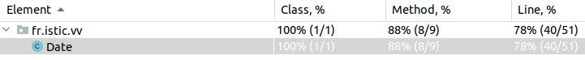
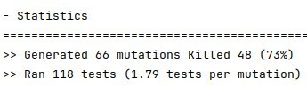

# Test the Date class

Implement a class `Date` with the interface shown below:

```java
class Date implements Comparable<Date> {

    public Date(int day, int month, int year) { ... }

    public static boolean isValidDate(int day, int month, int year) { ... }

    public static boolean isLeapYear(int year) { ... }

    public Date nextDate() { ... }

    public Date previousDate { ... }

    public int compareTo(Date other) { ... }

}
```

The constructor throws an exception if the three given integers do not form a valid date.

`isValidDate` returns `true` if the three integers form a valid year, otherwise `false`.

`isLeapYear` says if the given integer is a leap year.

`nextDate` returns a new `Date` instance representing the date of the following day.

`previousDate` returns a new `Date` instance representing the date of the previous day.

`compareTo` follows the `Comparable` convention:

* `date.compareTo(other)` returns a positive integer if `date` is posterior to `other`
* `date.compareTo(other)` returns a negative integer if `date` is anterior to `other`
* `date.compareTo(other)` returns `0` if `date` and `other` represent the same date.
* the method throws a `NullPointerException` if `other` is `null` 

Design and implement a test suite for this `Date` class.
You may use the test cases discussed in classes as a starting point. 
Also, feel free to add any extra method you may need to the `Date` class.


Use the following steps to design the test suite:

1. With the help of *Input Space Partitioning* design a set of initial test inputs for each method. Write below the characteristics and blocks you identified for each method. Specify which characteristics are common to more than one method.
2. Evaluate the statement coverage of the test cases designed in the previous step. If needed, add new test cases to increase the coverage. Describe below what you did in this step.
3. If you have in your code any predicate that uses more than two boolean operators check if the test cases written to far satisfy *Base Choice Coverage*. If needed add new test cases. Describe below how you evaluated the logic coverage and the new test cases you added.
4. Use PIT to evaluate the test suite you have so far. Describe below the mutation score and the live mutants. Add new test cases or refactor the existing ones to achieve a high mutation score.

Use the project in [tp3-date](../code/tp3-date) to complete this exercise.

## Answer

### 1. With the help of *Input Space Partitioning* design a set of initial test inputs for each method. Write below the characteristics and blocks you identified for each method. Specify which characteristics are common to more than one method.

#### Characteristics and blocks for each method:
1. Date(int day, int month, int year):
   - Valid day (1 to 31)
   - Valid month (1 to 12)
   - Valid year (e.g., positive integer)
   - Invalid combinations (e.g., February 30, April 31)
   - Leap year (for February)

2. isValidDate(int day, int month, int year):
   - Valid day (1 to 31)
   - Valid month (1 to 12)
   - Valid year (e.g., positive integer)
   - Invalid combinations (e.g., February 30, April 31)

3. isLeapYear(int year):
   - Leap year (e.g., 2020)
   - Non-leap year (e.g., 2021)

4. nextDate() and previousDate():
   - Regular day transition
   - End of the month transition
   - Leap year transition

5. compareTo(Date other):
   - Dates are equal
   - `date` is posterior to `other`
   - `date` is anterior to `other`

### 2. Evaluate the statement coverage of the test cases designed in the previous step. If needed, add new test cases to increase the coverage. Describe below what you did in this step.

For this exercise I used **"Run with Coverage"** feature in IntelliJ IDEA to evaluate the statement coverage of the test suite. Result:



As you can see from the result, not all methods are covered by tests, namely the test for the `toString` method is missing. I added the required test and ran "Run with Coverage" again:

```java
@Test
void testToString() { ... }
```


This ensured complete coverage of the methods by the tests.

### 3. If you have in your code any predicate that uses more than two boolean operators check if the test cases written to far satisfy *Base Choice Coverage*. If needed add new test cases. Describe below how you evaluated the logic coverage and the new test cases you added.
A `Base Choice Coverage` evaluation means that the logical condition is thoroughly tested, covering all possible combinations of boolean values (true/false) for each condition.

For the `isValidDate` method, there is a predicate with several conditions:

1. year < 0
2. month < 1
3. month > 12
4. month == 4 || month == 6 || month == 9 || month == 11
5. month == 2
6. day >= 1
7. day <= maxDays

But `testIsValidDate` now only covers one condition `assertTrue(Date.isValidDate(1, 1, 2024));`. Therefore, it needs to be extended:
```java
    @Test
    void testIsValidDate() {
        // Valid date
        assertTrue(Date.isValidDate(1, 1, 2024));

        // Invalid year
        assertFalse(Date.isValidDate(1, 1, -2024));

        // Invalid month (< 1)
        assertFalse(Date.isValidDate(1, 0, 2024));

        // Invalid month (> 12)
        assertFalse(Date.isValidDate(1, 13, 2024));

        // Invalid day (< 1)
        assertFalse(Date.isValidDate(0, 1, 2024));

        // Invalid day (> maxDays in month)
        assertFalse(Date.isValidDate(32, 1, 2024));

        // February in a non-leap year with day > 28
        assertFalse(Date.isValidDate(29, 2, 2023));

        // February in a leap year with day > 29
        assertFalse(Date.isValidDate(30, 2, 2024));
    }
```

The test cases now meet the `Base Choice Coverage`.

### 4. Use PIT to evaluate the test suite you have so far. Describe below the mutation score and the live mutants. Add new test cases or refactor the existing ones to achieve a high mutation score.

Mutation testing involves creating mutated versions of the code (mutants) and checking if the test suite can detect these mutations. A high mutation score indicates a robust test suite.

To run PIT I used the `mvn clean install org.pitest:pitest-maven:mutationCoverage` command in the `tp3-date` folder. Result: 



The mutation score of 73% is reasonably good, however, there's always room for improvement. I added some tests and ran the PIT again:


The mutation score improved to 76%, which is very good. 